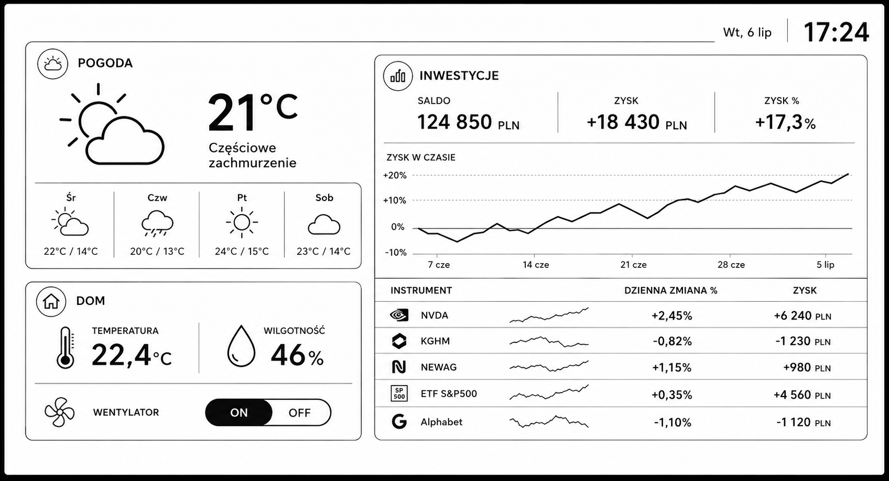

# LilyGO T5 ESPHome DeskHub


ESPHome dashboard for the LILYGO T5 4.7 inch ESP32-S3 e-paper board.

The project is meant to sit on a desk and show Home Assistant data: weather,
temperatures, local device health, Bluetooth proxy status, and investment
statistics from the companion XTB Home Assistant integration.



## Base

The display driver is based on
[nickolay/esphome-lilygo-t547plus](https://github.com/nickolay/esphome-lilygo-t547plus),
which targets the same LILYGO T5 4.7 inch ESP32-S3 / V2.3 board and exposes the
ED047TC1 panel as an ESPHome display component.

This repository vendors the `t547` component locally in `components/t547` and
adapts it for current ESPHome / Arduino 3 builds. The minimal ED047TC1 driver
sources are vendored from
[Xinyuan-LilyGO/LilyGo-EPD47](https://github.com/Xinyuan-LilyGO/LilyGo-EPD47)
so the ESPHome build does not depend on PlatformIO library discovery.

I reviewed [jtenniswood/espcontrol](https://github.com/jtenniswood/espcontrol)
as a strong Home Assistant control-panel reference. The dashboard is implemented
with ESPHome LVGL so the touchscreen can drive native widgets, including a
finger-scrollable investment list, while the custom e-paper driver still keeps
updates partial and deliberate.

## Features

- 960x540 ED047TC1 e-paper display through the external `t547` ESPHome component.
- LVGL-based single landscape dashboard matching the desk-panel mockup: weather,
  home climate, fan control, and investments.
- Material Design Icons rendered from a vendored icon font.
- Finger-scrollable investment list backed by the compact XTB DeskHub sensor,
  with fallback support for detailed XTB attributes.
- Investment summary chart with persisted history so the line is restored after
  firmware updates and restarts.
- Home Assistant imported sensors/text sensors for Tomorrow.io weather, local
  room conditions, fan state, and XTB balance attributes.
- LVGL touch buttons for the Home Assistant fan entity.
- Battery voltage and percentage from the board ADC on GPIO14.
- ESP32 internal temperature, WiFi RSSI, uptime and network details.
- GT911 touchscreen bus configured on GPIO18/GPIO17 with interrupt on GPIO47.
- Physical button on GPIO21 for manual display refresh.
- Home Assistant buttons for dashboard refresh, display refresh, restart and safe mode.
- Bluetooth proxy package enabled by the default `lilygo-t5-deskhub.yaml`.
- `lilygo-t5-deskhub-lite.yaml` without Bluetooth for Windows builds and first bring-up.
- Optional web server/captive portal package for browser diagnostics when the firmware budget allows it.

## Quick Start

1. Copy `secrets.yaml.example` to `secrets.yaml`.
2. Fill WiFi, OTA and API values.
3. Edit substitutions in `lilygo-t5-deskhub.yaml` to match your Home Assistant
   entity IDs. The default file is already wired for:
   `weather.tomorrow_io_karczewizna_hourly`,
   `sensor.biuro_2_warunki_temperature`,
   `sensor.biuro_2_warunki_humidity`, `fan.wentylator_2`, and
   `sensor.xtb_53600874_saldo`.
4. Build and flash the full Bluetooth-proxy variant:

```powershell
python -m esphome run lilygo-t5-deskhub.yaml
```

Use USB for the first flash. OTA should work after the device joins WiFi.

The native ESPHome API is intentionally left unencrypted by default for easier
first pairing in Home Assistant. Add an `api.encryption.key` later if you want
to lock it down.

On Windows, the ESP32-S3 Arduino 3 build can exceed the command-line length
limit when Bluetooth support is enabled. The configuration reads
`ESPHOME_BUILD_PATH`, so use a short path when compiling or flashing:

```powershell
$env:ESPHOME_BUILD_PATH = "C:/t5b"
python -m esphome run lilygo-t5-deskhub.yaml --device COM6
```

If Windows still reports `The command line is too long`, build the full
Bluetooth variant from the Home Assistant ESPHome add-on, Docker, WSL, or Linux.
For local display/touch/UI bring-up on Windows, use the lite variant:

```powershell
$env:ESPHOME_BUILD_PATH = "C:/t5b"
python -m esphome run lilygo-t5-deskhub-lite.yaml --device COM6
```

To enable browser diagnostics later, add this package to
`lilygo-t5-deskhub.yaml`. It also enables fallback AP and captive portal:

```yaml
packages:
  web_server: !include packages/web_server_optional.yaml
```

## Build Status

Validated locally with ESPHome `2026.6.0-dev` from `kyvaith/esphome`.

- `python -m esphome config lilygo-t5-deskhub.yaml` passes.
- `python -m esphome config lilygo-t5-deskhub-lite.yaml` passes.
- `python -m esphome compile lilygo-t5-deskhub.yaml` passes on Windows with a
  short build path.
- OTA upload to the target LilyGO T5 4.7 S3 board has been validated.

## Pages And Entities

The dashboard page is defined in `packages/display_pages.yaml` as an LVGL page.
The investment positions panel is a native LVGL scrollable object, so it should
scroll with a finger on the GT911 touchscreen.

Home Assistant entities are defined in `packages/ha_entities.yaml`. The top-level
`lilygo-t5-deskhub.yaml` file provides substitutions for the default entity IDs,
so the normal edit path is:

```yaml
substitutions:
  entity_indoor_temperature: sensor.office_temperature
  entity_indoor_humidity: sensor.office_humidity
  entity_fan: fan.office_fan
  entity_xtb_balance: sensor.xtb_53600874_saldo
```

The investment panel prefers the compact DeskHub sensor generated by the XTB
Home Assistant integration. It also keeps a 24-point local chart history in
ESPHome preferences, so the profit line does not restart from a flat placeholder
after firmware updates or device restarts.

## Refresh Strategy

The local `t547` component keeps a previous grayscale framebuffer in PSRAM,
detects the dirty rectangle, and updates only that area when possible. LVGL is
configured with 16 px draw rounding and calls the e-paper update after completed
draws; the driver expands dirty areas before sending them to the panel. The
desk dashboard sets `full_update_every: 0`, which disables scheduled full-screen
flashing after boot. Repeated refreshes also avoid resetting unchanged labels
and fan styles so identical Home Assistant data does not redraw the panel.

This is inspired by the Paperboy fast-refresh idea, but kept in ESPHome's
normal display pipeline so the dashboard can preserve 16-level grayscale
instead of switching the whole panel to a 1-bit animation path.

## Notes

- Bluetooth proxy is enabled, but ESPHome warns that memory can become tight on
  some boards. Use `lilygo-t5-deskhub-lite.yaml` for first bring-up or Windows
  builds that hit the command-line limit.
- The display is drawn in the board's landscape orientation. Do not add
  `display.rotation` when LVGL is enabled; use LVGL transform settings if a
  physical enclosure needs another orientation.
- The XTB card model is read from the balance entity attributes: `summary`,
  `positions`, and `unit_of_measurement`.
